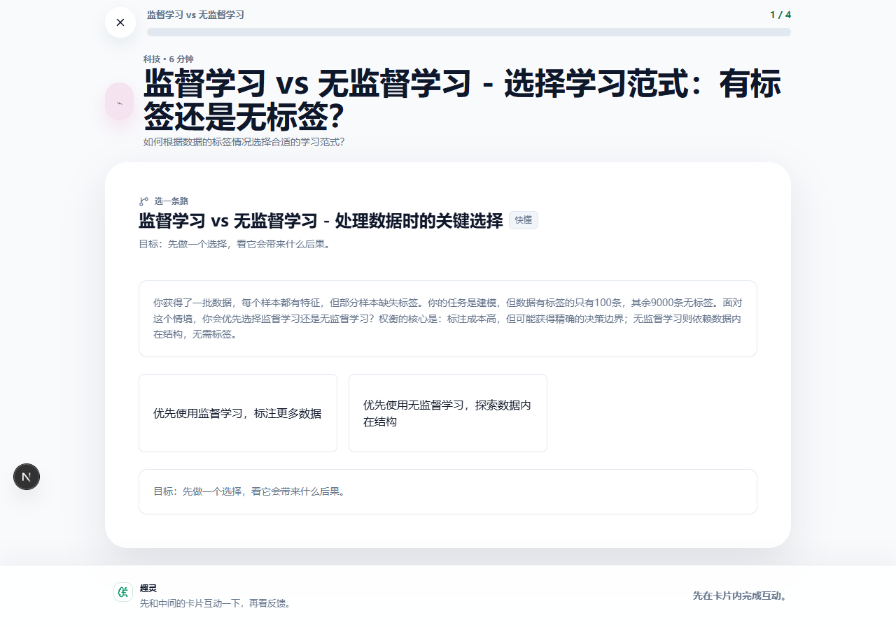

# 趣灵 Aha Flash

> 把“有点好奇但不想正经学习”的几分钟，变成一条能动手完成的知识路径。

[公开测试说明](docs/PUBLIC_BETA.md) · [项目案例](docs/PROJECT_CASE_STUDY.md) · [技术架构](docs/TECHNICAL.md)



趣灵是一款 AI 知识轻消费产品。用户选择一个概念，通过几关猜测、排序、对比、模拟或选择，在 3-5 分钟内获得一次“我好像真的懂了”的反馈。

## 当前状态

当前源码是 **V6 MVP 公开测试基础版**，默认采用静态公开模式：

| 能力 | 公开测试状态 |
|---|---|
| 五个精选主题 | 直接可玩，零模型调用 |
| 动态生成 | 默认关闭；可切换邀请或开放模式 |
| 配额与成本 | 持久化请求额度、token 预算、缓存和模型调用记录 |
| 产品数据 | 匿名漏斗、关卡互动、完成、二次探索、Hub 与理解反馈 |
| 用户系统 | 无账号、无数据库用户档案、无社区 |

生产环境只有同时配置显式动态开关和外部持久化存储时才会启用模型；缺少任一条件都会自动退回静态模式。

> 发布状态：本分支尚未部署，README 描述的是当前源码，不把历史线上版本冒充为本次公开测试版。

## 先玩什么

五个稳定入口覆盖：

- 贝叶斯定理
- DNS 解析
- 期权风险
- 工业革命
- 通胀与通缩

公开体验闭环：

```text
Explore 选择主题 -> 单关互动与反馈 -> 完成 Flow
-> 继续精选分支或进入 Hub -> 提交可选理解反馈
```

动态模式在此闭环之外只增加一个受控入口，不扩展内容引擎：

```text
Topic -> ConceptPlan -> Structure Skill -> KnowledgeBlueprint
-> Four-step Flow -> QualityGate -> Player
```

## 为什么生成可控

- 8 类通用 Structure Skill 负责知识组织，不为每个概念编写专用逻辑。
- KnowledgeBlueprint 规定每一步的教学目标、用户动作和主题锚点。
- 固定交互组件负责渲染选择、分类、时间线、参数探索和模拟。
- QualityGate 检查主题贴合、互动契约、文案、答案可辩护性和时长。
- 不合格结果进入修复、确定性兜底或 HonestFailure，不伪装成功。
- 公共模型入口统一经过模式、邀请码、请求配额、token 预算与缓存检查。

## 验证证据

| 检查 | 最近结果 |
|---|---:|
| 公开测试专项回归 | 14 / 14 通过 |
| 动态 Flow 结构 Eval | 9 / 9 通过 |
| Flow 质量 Eval | 15 / 15 通过，overall = 1 |
| 教学契约回归 | 通过 |
| 真实模型严格复验 | 1 / 1 通过，repair reliance = 0 |

专项回归覆盖生产无外部存储自动静态、五个精选 Flow 零模型调用、服务端静态拒绝、邀请码失效/过期/耗尽、请求与 token 双预算、预算后静态降级、缓存命中与坏缓存淘汰、Analytics 体积/隐私/去重、反馈限制与去重、管理员鉴权和完整指标计算。

## 本地运行

```bash
npm install
npm run dev
```

打开 [http://localhost:3000](http://localhost:3000)。默认不需要 API Key，五个精选主题可完整体验。

启用本地邀请模式时，在 `.env.local` 中配置：

```env
DEEPSEEK_API_KEY=
PUBLIC_FLOW_MODE=invite
DYNAMIC_GENERATION_ENABLED=1
PUBLIC_BETA_STORAGE=local
INVITE_CODE_PEPPER=
ADMIN_METRICS_SECRET=
```

创建邀请码：

```bash
npm run public-beta:admin -- create-invite --label=friend --max-uses=20 --days=14
```

生产动态模式必须使用 `PUBLIC_BETA_STORAGE=upstash`，并配置 `UPSTASH_REDIS_REST_URL` 与 `UPSTASH_REDIS_REST_TOKEN`。完整开关、配额、隐私与回滚说明见 [PUBLIC_BETA.md](docs/PUBLIC_BETA.md)。

主要验证命令：

```bash
npm run typecheck
npm run test:public-beta
npm run build
npm run eval:teaching
npm run eval:flow-dynamic
npm run eval:flow
```

## 项目边界

趣灵服务轻度好奇心用户，不是课程平台或个人知识库。账号、多设备同步、社区、长期知识图谱、重型 RAG、创作者后台和商业化均不在当前范围；V7 只保留为后续质量护栏。

## 文档

- [公开测试运行手册](docs/PUBLIC_BETA.md)
- [产品定义](docs/PRODUCT.md)
- [MVP 范围](docs/MVP_SCOPE.md)
- [技术架构](docs/TECHNICAL.md)
- [项目案例](docs/PROJECT_CASE_STUDY.md)
- [本次公开测试审计](docs/PUBLIC_BETA_RELEASE_AUDIT_2026-07-17.md)
- [历史线上发布审计](docs/RELEASE_AUDIT_2026-07-17.md)
- [变更记录](docs/CHANGELOG.md)
