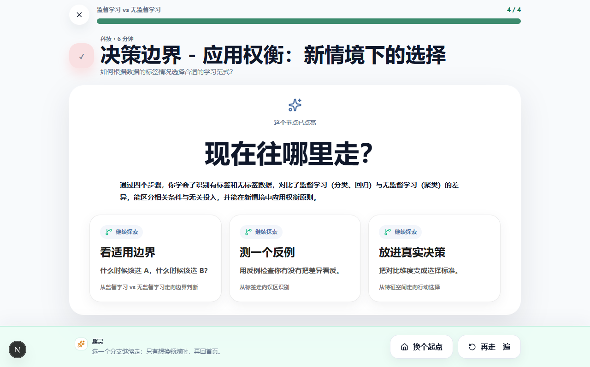
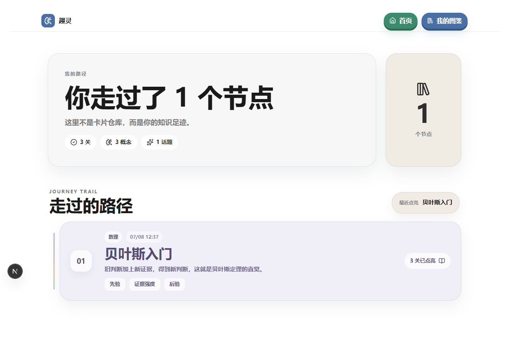

# 趣灵 Aha Flash

> AI 生成互动知识路径，让用户用几关小游戏把一个概念玩明白。

[在线体验](https://www.krie.me/explore) · [项目案例](docs/PROJECT_CASE_STUDY.md) · [发布审计](docs/RELEASE_AUDIT_2026-07-17.md)


趣灵面向“有点好奇，但不想正经学习”的时刻。用户输入或选择一个概念，AI 会把它拆成四步互动路径，让用户在 3-5 分钟内通过猜测、排序、对比、模拟或选择获得即时反馈。

## 产品闭环

1. 在 Explore 输入任意概念，或从稳定示例开始。
2. 查看 AI 的真实生成阶段与四步路径预览。
3. 每关只完成一个互动动作，先操作，再看反馈。
4. 完成后继续探索相关分支，或进入 Hub 回顾本机路径。

<p align="center">
  
  
</p>

五个稳定入口覆盖贝叶斯定理、DNS 解析、期权风险、工业革命、通胀与通缩；自由输入则由动态生成链路创建新的互动 Flow。

## 受控生成

```text
Topic -> ConceptPlan -> Structure Skill -> KnowledgeBlueprint -> Four-step Flow -> QualityGate -> Player
```

趣灵没有让 LLM 直接生成页面，而是把生成限制在可验证的结构中：

- 8 类通用 Structure Skill 负责选择知识组织方式，不为每个概念编写专用逻辑。
- KnowledgeBlueprint 规定四步教学目标、用户动作与必须出现的主题锚点。
- 固定交互组件负责渲染选择、分类、时间线、参数探索、模拟等体验。
- QualityGate 检查主题贴合、互动契约、用户文案、答案可辩护性和 3-5 分钟时长。
- 不合格结果进入 repair、确定性兜底或 HonestFailure，不伪装成功。

## 验证证据

| 检查 | 最近结果 |
|---|---:|
| 动态 Flow 结构 Eval | 9 / 9 通过 |
| Flow 质量 Eval | 15 / 15 通过，overall = 1 |
| 教学契约回归 | 通过 |
| 真实模型严格复验 | 1 / 1 通过，repair reliance = 0 |
| 线上发布审计 | Explore -> Flow -> Completion -> Hub 通过 |

最新发布审计同时验证了 4 分钟动态 Flow、知识检查主题贴合、移动端完成页和 Hub 持久化。详见 [Release Audit](docs/RELEASE_AUDIT_2026-07-17.md)。

## 技术栈

Next.js 16 · React 19 · TypeScript · AI SDK · DeepSeek · Tailwind CSS 4 · Zustand · Zod

## 本地运行

```bash
npm install
npm run dev
```

打开 [http://localhost:3000](http://localhost:3000)。没有 API Key 时仍可体验稳定示例和 topic-aware fallback；要测试真实动态生成，在 `.env.local` 中配置：

```env
DEEPSEEK_API_KEY=
DEEPSEEK_BASE_URL=https://api.deepseek.com
```

主要验证命令：

```bash
npm run typecheck
npm run build
npm run eval:teaching
npm run eval:flow-dynamic
npm run eval:flow
```

## 项目边界

当前是可公开试玩的 V6 MVP，服务轻度好奇心用户，不是课程平台或个人知识库。账号、数据库、多设备同步、社区、长期知识图谱和重型 RAG 均不在当前范围内。

## 文档

- [产品定义](docs/PRODUCT.md)
- [MVP 范围](docs/MVP_SCOPE.md)
- [技术架构](docs/TECHNICAL.md)
- [项目案例](docs/PROJECT_CASE_STUDY.md)
- [发布审计](docs/RELEASE_AUDIT_2026-07-17.md)
- [变更记录](docs/CHANGELOG.md)
