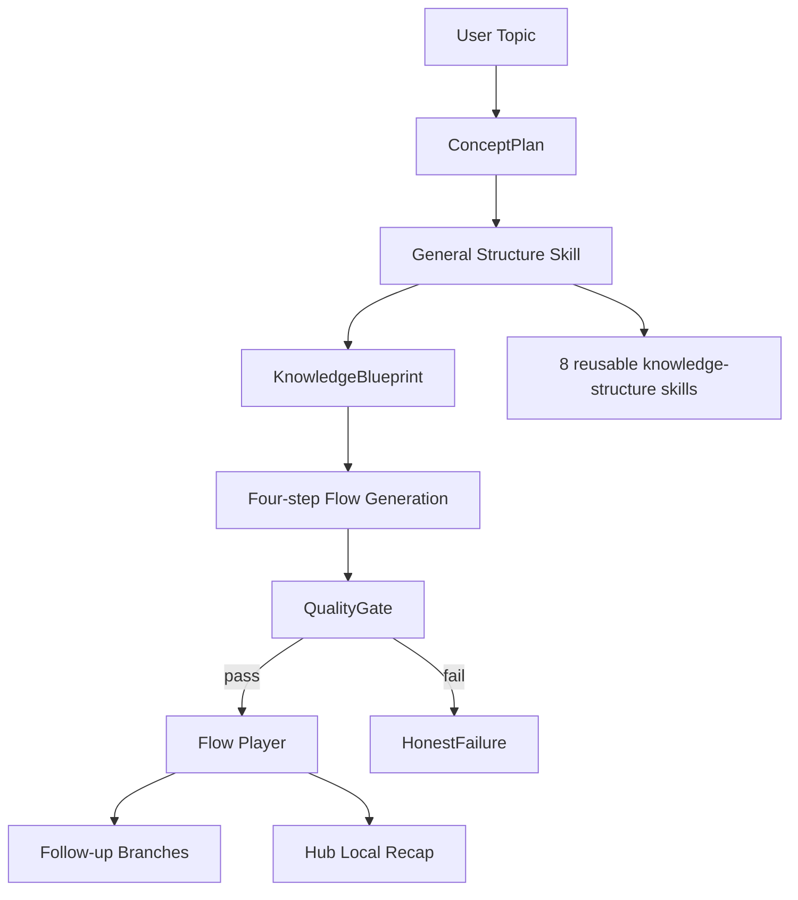

# 趣灵项目案例

日期：2026-07-08
版本口径：V6 MVP，可展示版本。V7 只作为后续质量护栏，不作为当前主线。

## 一句话定位

趣灵是一个把“有点好奇但不想正经学习”的时刻，转化成 3-5 分钟互动知识挑战的 AI 知识轻消费产品。

作品集短句：AI 生成互动知识路径，让用户用几关小游戏把一个概念玩明白。

## 要解决的问题

很多知识产品默认用户有强学习动机：愿意看长文、上课、做笔记、整理知识库。趣灵验证的是另一种场景：用户只是对一个概念有一点好奇，希望短时间获得“我好像懂了”的反馈。

因此趣灵不做课程平台、知识库、考试工具或个人知识管理系统。当前闭环只保留：

```text
打开 -> 输入/选择概念 -> 生成互动路径 -> 完成几关 -> 获得反馈 -> 继续探索或进入 Hub 回顾
```

## 产品取舍

- 只服务轻度好奇心用户，不服务深度课程和长期知识管理。
- 每次只呈现一个互动组件，让用户先动手，再看反馈。
- 动态生成失败时进入 HonestFailure，不伪装成功。
- Hub 只做本机轻量回顾，不做账号、数据库、多端同步。
- Eval 和 QualityGate 用来证明生成不是随机拼接，但不继续扩成重型评测平台。

## 核心体验

1. Explore：输入任意 topic，展示真实生成阶段。
2. Route Preview：生成四步互动路径，让用户知道接下来会怎么走。
3. Flow Player：每关一个互动组件，包含选择、分类、对比、滑块、模拟、测验等。
4. Feedback Gate：用户先互动，再看到对错、解释或结果，不能直接跳过关键反馈。
5. Follow-up：完成后给出后续分支，形成轻量连续探索。
6. Hub：记录本机完成过的 Flow，用于回顾“走过的节点”。

## 技术架构



关键设计点：

- ConceptPlan 负责理解 topic 和学习目标。
- 8 类通用 Structure Skill 负责知识结构，而不是为每个概念写专用 skill。
- KnowledgeBlueprint 把概念拆成四步教学路径。
- QualityGate 检查主题贴合、互动契约、可见文案和结构完整性。
- Flow Player 负责把结构化结果变成可交互体验。

## 为什么要约束 LLM

直接让 LLM 生成完整页面，容易出现三个问题：

- 输出像后台 schema，而不是用户能读懂的产品文案。
- 互动和教学目标错位，例如页面说排序，但实际只有滑条。
- 生成内容看似完整，但没有可验证的结构和反馈闭环。

趣灵的做法是把 LLM 放在受控链路里：先规划，再选结构，再生成 Blueprint，再过 QualityGate，最后渲染到固定交互组件。

## Eval 证据

最近一次确定性验证结果：

| Eval | Scope | Result |
|---|---:|---|
| `npm run eval:score` | 32 cases | overall = 1 |
| `npm run eval:flow` | 15 cases / 3 flows | overall = 1 |
| `npm run eval:blueprint` | 81 cases | overall = 1 |
| `npm run eval:skills` | 8 skills | overall = 1 |
| `npm run eval:math` | formula-backed interactions | score = 1 |
| `npm run eval:teaching` | teaching contract checks | passed |

历史 live eval 记录：8/8 structure cases passed，`overall=1`，`llm_success_rate=1`，`schema_repair_rate=0`。这说明 V6 动态链路已经可以作为 MVP 展示，但它不等于事实知识库；内容准确性仍需要后续质量护栏继续增强。

## 截图资产

截图位于本机目录：`output/playwright/portfolio-2026-07-08/`。该目录按项目规则被 gitignore 忽略，作为本机作品集素材保存。

| File | Use |
|---|---|
| `01-explore-input.png` | Explore 自由输入入口 |
| `02-generation-stage.png` | AI 生成阶段 |
| `03-route-preview.png` | 四步路径预览 |
| `04-flow-interaction.png` | Flow 互动卡片 |
| `05-completion-branches.png` | 完成后的继续探索分支 |
| `06-hub-recap.png` | Hub 本机回顾页 |

## 本轮浏览器验证

动态主题：监督学习 vs 无监督学习。

实际走通：Explore 输入、生成阶段、路径预览、Flow 第一关、完成分支。分类关交互机制正确：错选不会推进、正确分类才计数、没有重复进度计数。选择题也会先展示对错和解释，再允许继续。

同时发现一个内容边界：动态分类关曾生成“过去一直使用监督学习，不想改变投入”这类无关投入项，但类别只有“偏向监督学习 / 偏向无监督学习”。交互机制能防止错选推进，但这说明生成内容仍需要后续质量护栏约束类别颗粒度和文案匹配，而不是为某个概念写专用修复。

## 本轮修复

- Follow-up 分支标签从 `AI 延伸` 改为 `继续探索`，减少前台生成器味道。
- Narrative branch 的完成提示改为通用表达，不再套用沉没成本专属文案。
- Hub 完成记录对动态 Flow 增加 concepts 兜底，避免缺少 `concepts` 时本机回顾过滤掉记录。

## 项目价值表达

面试讲法：

> 我做趣灵是为了验证一种介于短视频消遣和正式学习之间的体验。用户不需要上课或整理笔记，只要输入一个感兴趣的概念，系统就把它拆成几步互动挑战。技术上，我没有让 LLM 直接生成页面，而是用 ConceptPlan、Structure Skill、KnowledgeBlueprint 和 QualityGate 约束生成，再用固定交互组件渲染，最后通过 Eval 回归验证质量。

简历口径：

> 趣灵 - AI 知识轻消费产品。面向轻度好奇心用户，将任意概念拆解为 3-5 分钟的互动知识挑战；通过 ConceptPlan、通用 StructureSkill、KnowledgeBlueprint 和 QualityGate 约束 LLM 生成，避免自由生成带来的不可控输出，并用自动化 Eval 回归验证 AI 内容质量。

## 当前边界

当前版本适合展示产品闭环和工程约束能力，不应包装成完整知识库或严肃课程系统。后续 V7 更适合做“质量护栏”：主题贴合、文案风格、互动匹配、必要时的 SourcePack，而不是把趣灵扩成重型 RAG 或个人知识系统。
